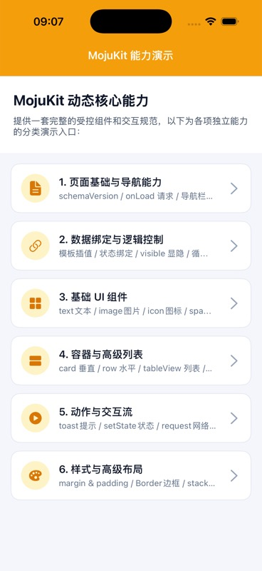
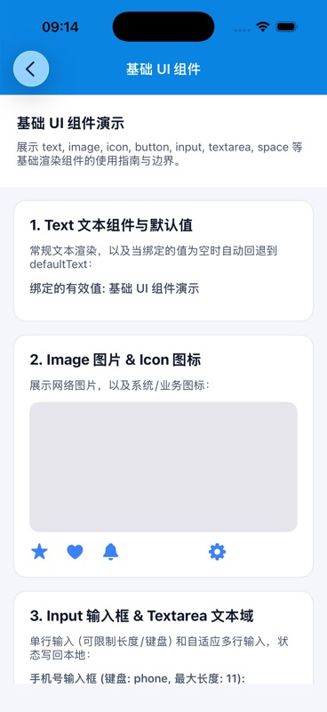
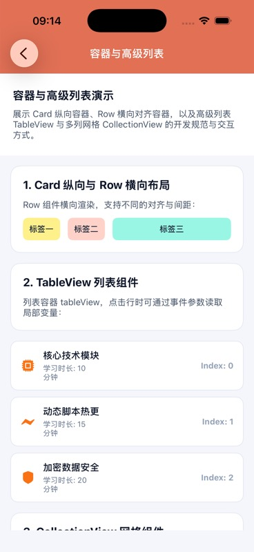
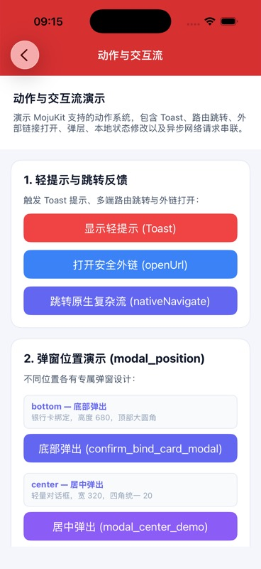
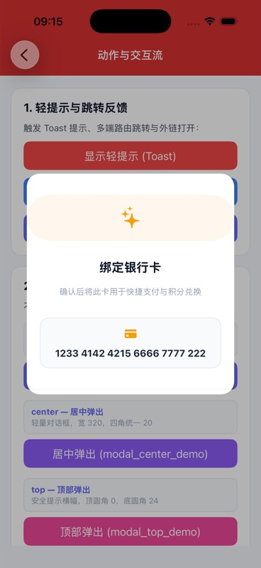
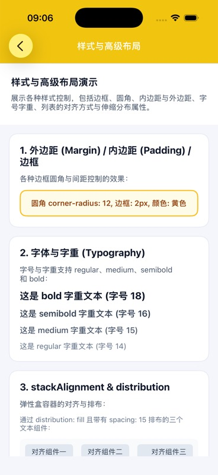

# MojuKit

MojuKit 是一个面向 iOS App 的 UIKit 动态页面运行时，以及配套的页面编译器、VS Code 插件和预览工程。

它把页面结构、样式、数据请求和受控交互放进 JSON / DKML / DKSS / JS 流程里，由 App 侧提供网络、路由、埋点和风控能力。这样业务可以在保持原生体验的同时，更快迭代活动页、表单页、会员页、弹窗和列表页。

## 功能演示


下面截图来自已运行的 iOS Simulator，展示 Demo 首页、基础组件、容器列表、动作流、弹窗和样式能力详情页的真实渲染效果：

<p>
  
  
  
  
  
  
</p>

### 演示 1：本地启动 iOS 预览

1. 打开 `MojuKit/MojuKitPreview.xcodeproj`
2. 选择 `MojuKitPreview` scheme
3. 运行到 iPhone Simulator
4. 在预览 App 中选择本地示例 JSON 或通过 VS Code 插件启动远程预览服务

宿主工程路径：

```text
MojuKit/MojuKitPreview.xcodeproj
```

### 演示 2：VS Code 插件预览页面

插件目录：

```text
VSCodeExtension/dynamicpagekit-studio
```

常用命令：

- `DynamicPageKit: New Page`
- `DynamicPageKit: Import JSON`
- `DynamicPageKit: Save and Compile`
- `DynamicPageKit: Start Preview Service`
- `DynamicPageKit: 关闭预览服务`
- `DynamicPageKit: Start Preview`
- `DynamicPageKit: Refresh Active Page`

预览服务默认地址：

```text
http://127.0.0.1:8088
```

常用接口：

```text
GET /health
GET /active-page.json
GET /manifest.json
GET /page/{PageName}.json
GET /dynamic/runtime/manifest?projectKey=my_project
GET /dynamic/runtime/page?projectKey=my_project&page=ETCList
GET /dynamic/runtime/package?projectKey=my_project
```

插件说明见 [VS Code Extension README](./VSCodeExtension/dynamicpagekit-studio/README.md)。

### 演示 3：编译项目页面

在 `MojuKit/` 目录执行：

```bash
swift run DynamicPageKitCLI compile-project \
  --project-dir . \
  --active DynamicPageDemo
```

编译后可以得到 active page 和全部页面的运行时 JSON，用于本地预览服务或 App 集成。

### 演示 4：打包 `.dpk`

VS Code 插件支持导出 `.dpk` 加密包。App 侧用同一个 secret 解包：

```swift
let package = try MojuDPKDecoder.decodePackage(
    from: dpkData,
    secret: Data("your-app-secret".utf8)
)

let page = package.activePage
```

`.dpk` 适合线上分发，但 secret、版本策略、灰度和回滚要由业务发布系统管理。

## 适合场景

- 运营活动页、会员中心、权益领取页
- 表单、确认弹窗、协议页、信息展示页
- 后台配置驱动的列表、宫格、卡片流
- 需要本地预览、编译、打包、上传的动态页面工作流
- 不希望引入 WebView 或远程代码执行的原生动态 UI

## 仓库结构

```text
.
├── MojuKit/
│   ├── MojuKit/                  # Swift Package SDK
│   ├── App/                      # MojuKitPreview iOS 宿主工程源码
│   ├── Sources/                  # DynamicPageKit Studio / CLI / Core
│   ├── Tests/                    # 编译器、CLI、预览服务测试
│   ├── Docs/                     # 接入和能力文档
│   └── pages/                    # 可直接预览的页面示例
├── VSCodeExtension/
│   └── dynamicpagekit-studio/    # VS Code 插件
└── StudioApp/                    # 本地 Studio 应用资源
```

## 核心能力

- **原生渲染**：用 UIKit 渲染 `text`、`image`、`button`、`input`、`textarea`、`card`、`row`、`tableView`、`collectionView` 等组件。
- **模板绑定**：支持 `{{pageParams.xxx}}`、`{{responseKey.xxx}}`、循环局部变量等数据绑定。
- **动作系统**：支持 `navigate`、`nativeNavigate`、`showModal`、`openUrl`、`request`、`setState`、`track`、`toast`、`sequence`、`delay`。
- **受控网络**：JSON 只写 `apiKey`，真实接口、鉴权、签名、风控由业务 App 的 `MojuNetworkProviding` 实现。
- **列表和循环**：支持普通 `forEach`、`tableView`、`collectionView`，循环项内 action 可读取当前 item/index。
- **加密包**：支持 `.dpk` 包解码，使用 AES-GCM 加密页面包。
- **本地工具链**：提供 Swift CLI、预览 HTTP 服务、VS Code 插件、iOS Simulator 预览宿主。
- **上架收口**：SDK 不执行远程 Swift/Objective-C/JavaScript；未知 `apiKey` 默认拒绝；包含 `PrivacyInfo.xcprivacy`。

## 快速接入

### 1. 添加 Swift Package

在 Xcode 中通过 GitHub URL 添加 Swift Package：

```text
https://github.com/HisongMo/MojuKit.git
```

如果是本地源码调试，可以添加仓库根目录，或直接添加本仓库内的 `MojuKit/MojuKit` 目录。然后在业务 target 中引入：

```swift
import MojuKit
```

### 2. 准备网络适配器

MojuKit 不直接请求业务接口。页面里的 `apiKey` 必须由业务侧映射到已审核、已允许的接口能力。

```swift
import MojuKit

final class AppNetworkProvider: MojuNetworkProviding {
    func request(apiKey: String, params: [String: Any]) async throws -> Any {
        switch apiKey {
        case "vipInfo":
            return [
                "name": "黄金会员",
                "expireDate": "2026-12-31",
                "bannerUrl": "https://example.com/banner.png"
            ]
        case "couponList":
            return [
                ["id": "c1", "title": "满 100 减 20"],
                ["id": "c2", "title": "洗车券"]
            ]
        default:
            throw MojuPageError.unsupportedAPI
        }
    }
}
```

### 3. 渲染一个页面

```swift
import UIKit
import MojuKit

func openDynamicPage(jsonData: Data, navigationController: UINavigationController) {
    do {
        let page = try MojuSchemaValidator.decodePage(from: jsonData)
        let viewController = MojuPageViewController(
            page: page,
            networkProvider: AppNetworkProvider()
        )

        viewController.onNavigate = { target, params in
            // 加载 target 对应的动态页，再 push 一个 MojuPageViewController。
        }

        viewController.onNativeNavigate = { target, params in
            // 只允许跳转到 App 内置白名单原生页面。
        }

        viewController.onTrackEvent = { eventName, params in
            // 接入业务埋点系统。
        }

        viewController.onConfirmHighRiskRequest = { apiKey, params, completion in
            // 高风险接口在业务侧二次确认。
            completion(true)
        }

        navigationController.pushViewController(viewController, animated: true)
    } catch {
        // JSON 无效、schema 不支持、组件过多、层级过深等都会在这里抛出。
    }
}
```

更多接入细节见 [MojuKit 接入文档](./MojuKit/Docs/MojuKit-Integration.md)。

## 页面 JSON 示例

下面是一个最小会员页：进入页面后请求会员信息，渲染标题、有效期和底部按钮。

```json
{
  "schemaVersion": "1.0",
  "pageId": "vip_center",
  "pageTitle": "会员中心",
  "backgroundColor": "#F7F8FA",
  "pageParams": {
    "source": "home"
  },
  "onLoad": [
    {
      "id": "load_vip_info",
      "apiKey": "vipInfo",
      "params": {
        "source": "{{pageParams.source}}"
      },
      "responseKey": "vipData",
      "showLoading": true,
      "loadingText": "加载中"
    }
  ],
  "components": [
    {
      "type": "text",
      "text": "{{vipData.name}}",
      "style": {
        "marginTop": 24,
        "marginLeft": 16,
        "fontSize": 24,
        "fontWeight": "semibold",
        "textColor": "#111111"
      }
    },
    {
      "type": "text",
      "text": "有效期至：{{vipData.expireDate}}",
      "style": {
        "marginTop": 8,
        "marginLeft": 16,
        "textColor": "#666666"
      }
    }
  ],
  "fixedBottomComponents": [
    {
      "type": "button",
      "text": "立即开通",
      "action": {
        "type": "request",
        "request": {
          "apiKey": "openVip",
          "showLoading": true,
          "loadingText": "开通中",
          "successAction": {
            "type": "toast",
            "message": "开通成功"
          }
        }
      },
      "style": {
        "height": 48,
        "marginLeft": 16,
        "marginRight": 16,
        "backgroundColor": "#2F80ED",
        "textColor": "#FFFFFF",
        "cornerRadius": 8
      }
    }
  ]
}
```

## DKML / DKSS / JS 示例

开发阶段可以用类小程序的四文件结构编写页面，再通过 CLI 编译成运行时 JSON。

```xml
<!-- index.dkml -->
<page class="page">
  <text class="title">{{vipData.name}}</text>
  <text class="subtitle">有效期至：{{vipData.expireDate}}</text>
  <button class="primary-button" bindtap="openVip">立即开通</button>
</page>
```

```css
/* index.dkss */
.page {
  background-color: #F7F8FA;
}

.title {
  margin: 24 16 8 16;
  font-size: 24;
  font-weight: semibold;
  text-color: #111111;
}

.subtitle {
  margin: 0 16 16 16;
  text-color: #666666;
}

.primary-button {
  height: 48;
  margin: 16 16 0 16;
  background-color: #2F80ED;
  text-color: #FFFFFF;
  corner-radius: 8;
}
```

```js
// index.js
Page({
  data: {},

  onLoad() {
    dk.request({
      apiKey: "vipInfo",
      responseKey: "vipData",
      showLoading: true,
      loadingText: "加载中"
    })
  },

  methods: {
    openVip() {
      dk.request({
        apiKey: "openVip",
        showLoading: true,
        success() {
          dk.toast("开通成功")
        }
      })
    }
  }
})
```

```json
// index.json
{
  "schemaVersion": "1.0",
  "pageId": "vip_center",
  "pageTitle": "会员中心"
}
```

仓库里可直接参考这些示例：

- [DynamicPageDemo](./MojuKit/pages/DynamicPageDemo)
- [DynamicPageETCBindingDemo](./MojuKit/pages/DynamicPageETCBindingDemo)
- [Preview pages](./MojuKit/App/DynamicPage/Demo/pages)

## 受控能力和上架边界

MojuKit 的定位是 **native JSON renderer**，不是热更新框架，也不是远程代码执行平台。

已经做的收口：

- 不使用 `JSContext`、`WKWebView` 或 `eval` 执行远程代码。
- JSON 只描述页面、样式、数据绑定和受控动作。
- `request` 只接受白名单 `apiKey`，未知接口默认拒绝。
- `nativeNavigate`、`openUrl`、`showModal` 都回调给业务 App，由业务侧决定是否允许。
- SDK 包含 `PrivacyInfo.xcprivacy`，默认声明 SDK 自身不采集数据、不追踪用户。

接入方仍需遵守这些原则：

- 远程 JSON 只能组合 App 已内置、已审核、白名单内的能力。
- 不要通过动态页新增审核不可见的核心功能、支付能力或敏感权限入口。
- `apiKey`、原生路由 target、外链域名都应由业务侧白名单控制。
- 高风险接口必须二次确认或走业务风控。
- App Review Notes 建议说明：MojuKit 不下载/执行代码，只渲染受控 JSON 配置。

## 开发和验证

### Studio / CLI 测试

```bash
cd MojuKit
swift test
```

### iOS 宿主工程构建

```bash
cd MojuKit
xcodebuild \
  -project MojuKitPreview.xcodeproj \
  -scheme MojuKitPreview \
  -destination 'generic/platform=iOS Simulator' \
  -derivedDataPath .build/ValidationDerivedData \
  -quiet \
  build
```

### VS Code 插件检查

```bash
cd VSCodeExtension/dynamicpagekit-studio
npm run compile
npm run package
```

## 文档

- [MojuKit 接入文档](./MojuKit/Docs/MojuKit-Integration.md)
- [MojuKit 能力支持列表](./MojuKit/Docs/MojuKit-Capability-Support.md)
- [VS Code 插件文档](./VSCodeExtension/dynamicpagekit-studio/README.md)

## 当前状态

- 最低支持 iOS 15。
- SDK 和 Demo 仍保留 `MojuKit` / `DynamicPageKit` 两套历史命名，后续可逐步统一。
- 根目录 README 关注整体说明；具体 schema、组件、动作和接入细节请以 `MojuKit/Docs` 为准。
